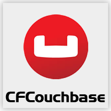

# Introduction

```text
          __       __________________                 __    __                  
      ____\ \     / ____/ ____/ ____/___  __  _______/ /_  / /_  ____ _________ 
     /____/\ \   / /   / /_  / /   / __ \/ / / / ___/ __ \/ __ \/ __ `/ ___/ _ \
    /____/ / /  / /___/ __/ / /___/ /_/ / /_/ / /__/ / / / /_/ / /_/ (__  )  __/
          /_/   \____/_/    \____/\____/\__,_/\___/_/ /_/_.___/\__,_/____/\___/
```



## Welcome to CFCouchbase SDK v2.2.0

The CFCouchbase SDK is a CFML library for interacting with [Couchbase NoSQL Server](http://www.couchbase.com). It can be used by any CFML application or CFML framework to provide them with NoSQL, distributed caching, dynamic queries and many more capabilities. The CFCouchbase SDK wraps the Couchbase Java SDK and enhances it to provide with a nice dynamic language syntax and usability.

> **Info** Initially sponsored by Guardly, Inc \([www.guardly.com](http://www.guardly.com)\)
>
> Couchbase is copyright and a registered trademark by Couchbase, Inc.

## Versioning

CFCouchbase is maintained under the [Semantic Versioning](https://semver.org) guidelines as much as possible. Releases will be numbered with the following format:

```text
<major>.<minor>.<patch>
```

And constructed with the following guidelines:

* Breaking backward compatibility bumps the major \(and resets the minor and patch\)
* New additions without breaking backward compatibility bumps the minor \(and resets the patch\)
* Bug fixes and misc changes bumps the patch

### License

CFCouchbase is open source and licensed under the [Apache 2](http://www.apache.org/licenses/LICENSE-2.0.html) License.

## Discussion & Help

The CFCouchbase help and discussion group can be found here: [https://groups.google.com/a/ortussolutions.com/forum/\#!forum/cfcouchbase](https://groups.google.com/a/ortussolutions.com/forum/#!forum/cfcouchbase)

## Reporting a Bug

We all make mistakes from time to time :\) So why not let us know about it and help us out. We also love pull requests, so please star us and fork us: [https://github.com/Ortus-Solutions/cfcouchbase-sdk](https://github.com/Ortus-Solutions/cfcouchbase-sdk)

* By Jira: [https://ortussolutions.atlassian.net/browse/COUCHBASESDK](https://ortussolutions.atlassian.net/browse/COUCHBASESDK)

## Professional Open Source


CFCouchbase is a professional open source software backed by [Ortus Solutions, Corp](http://www.ortussolutions.com/products/cfcouchbase) offering services like:

* Custom Development
* Professional Support & Mentoring
* Training
* Server Tuning
* Security Hardening
* Code Reviews
* [Much More](http://www.ortussolutions.com/services)

### Resources

* Source Code - [https://github.com/Ortus-Solutions/cfcouchbase-sdk](https://github.com/Ortus-Solutions/cfcouchbase-sdk)
* Tracker Site \(Bug Tracking, Issues\) - [https://ortussolutions.atlassian.net/browse/COUCHBASESDK](https://ortussolutions.atlassian.net/browse/COUCHBASESDK)
* Documentation - [https://cfcouchbase.ortusbooks.com/](https://cfcouchbase.ortusbooks.com/)
* Blog - [http://www.ortussolutions.com/blog](http://www.ortussolutions.com/blog)
* Official Site - [https://www.ortussolutions.com/products/cfcouchbase](https://www.ortussolutions.com/products/cfcouchbase)

#### HONOR GOES TO GOD ABOVE ALL

Because of His grace, this project exists. If you don't like this, then don't read it, its not for you.

> Therefore being justified by **faith**, we have peace with God through our Lord Jesus Christ: By whom also we have access by **faith** into this **grace** wherein we stand, and rejoice in hope of the glory of God. - Romans 5:5

